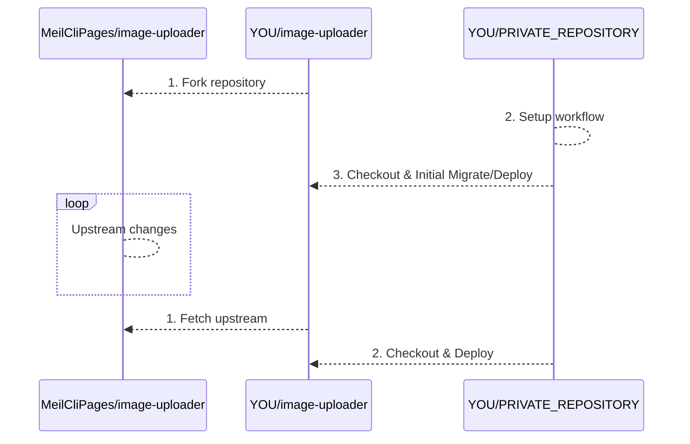

# Private management
GitHub cannot fork a public repository as private. So, this repository cannot fork as private.
Thinking security, you might feel to avoid public repository.

In the case, it is good that make private repository for running GitHub Action. 



## Workflow
### Secrets
|Name|Description|
|:--|:--|
|CLOUDFLARE_ACCOUNT_ID|https://developers.cloudflare.com/fundamentals/setup/find-account-and-zone-ids/|
|CLOUDFLARE_API_TOKEN|https://developers.cloudflare.com/workers/wrangler/ci-cd/#api-token|

### Variables
|Name|Description|
|:--|:--|
|WORKER_NAME|The worker name|
|ZONE_NAME|The image and upload hosting zone|
|IMAGE_HOST|The image host|
|UPLOAD_HOST|The upload host|
|D1_DATABASE_NAME|The D1 database name|
|D1_DATABASE_ID|The D1 database id|
|R2_BUCKET_NAME|The R2 bucket name|

### Deploy workflow sample
```yml
name: Execute Deploy

on:
  workflow_dispatch:

jobs:
  execute:
    runs-on: ubuntu-latest
    steps:
      - uses: actions/checkout@v4
        with:
          repository: 'MeilCliPages/image-uploader' # Replace your forked repository
      - name: 'Replace wrangler.toml'
        run: |
          sed -i 's/image-uploader/${{ vars.WORKER_NAME }}/' wrangler.toml
          sed -i 's/image.example.com/${{ vars.IMAGE_HOST }}/' wrangler.toml
          sed -i 's/upload.example.com/${{ vars.UPLOAD_HOST }}/' wrangler.toml
          sed -i 's/d1-example-com/${{ vars.D1_DATABASE_NAME }}/' wrangler.toml
          sed -i 's/d1-database-id/${{ vars.D1_DATABASE_ID }}/' wrangler.toml
          sed -i 's/r2-example-com/${{ vars.R2_BUCKET_NAME }}/' wrangler.toml
          sed -i 's/example.com/${{ vars.ZONE_NAME }}/' wrangler.toml
          cat wrangler.toml
      - uses: actions/setup-node@v4
        with:
          node-version: 20
      - run: npm ci
      - run: npm run generate
      - name: 'Build & Deploy Worker'
        uses: cloudflare/wrangler-action@v3
        with:
          apiToken: ${{ secrets.CLOUDFLARE_API_TOKEN }}
          accountId: ${{ secrets.CLOUDFLARE_ACCOUNT_ID }}
          wranglerVersion: '3.52.0' # Sync the version of package.json
```

### D1 Migration sample
```yml
name: Execute D1 Migration

on:
  workflow_dispatch:

jobs:
  execute:
    runs-on: ubuntu-latest
    steps:
      - uses: actions/checkout@v4
        with:
          repository: 'MeilCliPages/image-uploader' # Replace your forked repository
      - name: 'Replace wrangler.toml'
        run: |
          sed -i 's/image-uploader/${{ vars.WORKER_NAME }}/' wrangler.toml
          sed -i 's/image.example.com/${{ vars.IMAGE_HOST }}/' wrangler.toml
          sed -i 's/upload.example.com/${{ vars.UPLOAD_HOST }}/' wrangler.toml
          sed -i 's/d1-example-com/${{ vars.D1_DATABASE_NAME }}/' wrangler.toml
          sed -i 's/d1-database-id/${{ vars.D1_DATABASE_ID }}/' wrangler.toml
          sed -i 's/r2-example-com/${{ vars.R2_BUCKET_NAME }}/' wrangler.toml
          sed -i 's/example.com/${{ vars.ZONE_NAME }}/' wrangler.toml
          cat wrangler.toml
      - uses: actions/setup-node@v4
        with:
          node-version: 20
      - run: npm ci
      - run: npm run generate
      - name: 'Migrate D1'
        uses: cloudflare/wrangler-action@v3
        with:
          apiToken: ${{ secrets.CLOUDFLARE_API_TOKEN }}
          accountId: ${{ secrets.CLOUDFLARE_ACCOUNT_ID }}
          wranglerVersion: '3.52.0' # Sync the version of package.json
          command: d1 migrations apply ${{ vars.D1_DATABASE_NAME }} --remote
```